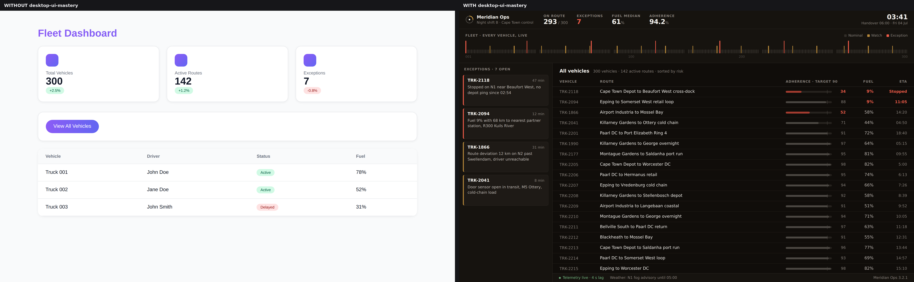
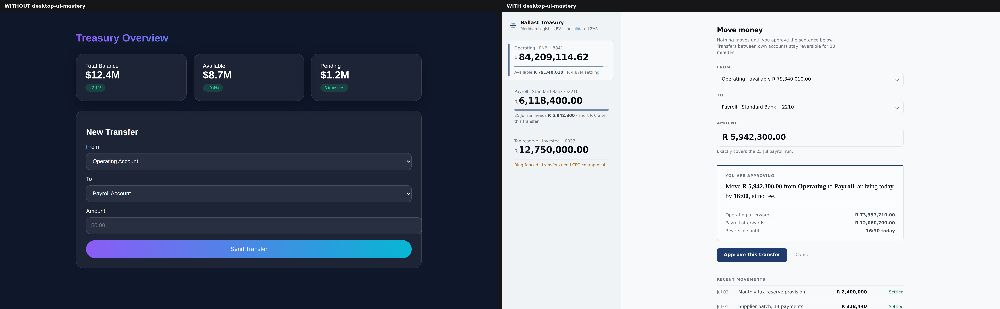

# Desktop UI Mastery

The reasoning-first UI design plugin for Claude Code, focused on desktop applications.





Same briefs, same model. Left: default generation (13 severe lint findings across five briefs: purple gradients, card soup, website font scales, placeholder people, dead keyboards). Right: the full workflow including the craft pass (0 severe findings; a written point of view, derived tokens, exemplar anatomy, and a novelty-ledger entry per design). Five briefs were run in total; these two were taken to full polish, three more ship as mechanics-verified draft HTML, and the difference between those tiers taught the skill its craft-pass rule: lint-clean is the floor, not the finish. Raw files and honest methodology caveats in [`evals/`](evals/).

30 masters of design decomposed into stealable principles. Four annotated exemplar anatomies that separate structure from skin. A token derivation engine instead of a palette menu. A slop linter that enforces the rules deterministically. Critique, deslop, and envision modes. Design memory that persists per project. And a synthesis method that tests every output for originality.

Not a style database. Not a brand-token library. The popular design skills are style pickers (searchable menus of glassmorphism and claymorphism palettes) or brand cloners (pixel-accurate "build it like Stripe" tokens). This plugin takes the opposite bet: teach the model the reasoning of the best designers in history, force deliberate tension between influences, verify the output against the rules, and test it for originality. Steal like an artist, from the masters, toward the future.

## Install

### One line, any tool

```bash
curl -fsSL https://raw.githubusercontent.com/SamuraiZac/desktop-ui-mastery/main/install.sh | bash
```

Clones the library to `~/.desktop-ui-mastery` and wires it into every AI coding tool it detects (Claude Code, Codex). Re-run any time to update. Target specific tools with `--claude`, `--codex`, `--agents`, or `--all`; or set `DUIM_TOOLS=claude,codex`. Prefer not to pipe to a shell? Read [`install.sh`](install.sh) first, or follow the per-tool steps below.

### Claude Code (plugin — recommended)

Gets the skill, the `/ui-critique` `/ui-deslop` `/ui-envision` commands, and the optional auto-lint hook, all wired:

```
/plugin marketplace add SamuraiZac/desktop-ui-mastery
/plugin install desktop-ui-mastery
```

Skill only (no commands): `bash install.sh --claude`, or clone and point `~/.claude/skills/desktop-ui-mastery` at the inner `skills/desktop-ui-mastery/` directory (that folder — the one holding `SKILL.md` — is the skill; the repo root is the plugin). For one project, drop that folder into the repo's `.claude/skills/`; it loads for every collaborator after the trust prompt.

### Codex

```bash
curl -fsSL https://raw.githubusercontent.com/SamuraiZac/desktop-ui-mastery/main/install.sh | bash -s -- --codex
```

Installs `/ui-critique`, `/ui-deslop`, `/ui-envision` as Codex prompts in `~/.codex/prompts/` and adds a pointer to `~/.codex/AGENTS.md` so the skill loads for UI work.

### Cursor, Gemini CLI, Amp, Cline — anything that reads `AGENTS.md`

From your project root:

```bash
curl -fsSL https://raw.githubusercontent.com/SamuraiZac/desktop-ui-mastery/main/install.sh | bash -s -- --agents
```

Appends a block to `./AGENTS.md` telling the agent to read the skill for desktop-UI tasks. (Cursor also reads `AGENTS.md`; no extra rule file needed.)

### Optional auto-linting

Rename `hooks/hooks.json.example` to `hooks/hooks.json` and every HTML/CSS/JSX/TSX write is checked for generated-UI tells automatically (non-blocking; requires python3). The Claude Code plugin install picks this up when enabled.

Then prompt naturally: "Design the main workspace for a fleet-monitoring desktop app."

## What's inside

```
desktop-ui-mastery/
├── install.sh                         Universal installer (Claude Code, Codex, AGENTS.md)
├── .claude-plugin/
│   ├── plugin.json                    Plugin manifest
│   └── marketplace.json               One-line /plugin install for Claude Code
├── commands/                          /ui-critique  /ui-deslop  /ui-envision
├── hooks/hooks.json.example           Optional PostToolUse auto-lint
├── evals/                             14 graded briefs across all four modes
└── skills/desktop-ui-mastery/
    ├── SKILL.md                       Router: modes, workflow, lens matrix, anti-patterns
    ├── exemplars/                     Four annotated working anatomies; every
    │   ├── app-shell.html             principle-bearing line cites its source.
    │   ├── data-table.html            app-shell includes a POV switcher: three
    │   ├── command-palette.html       different designs from one markup, proving
    │   └── settings-surface.html      anatomy is fixed and skin is derived
    ├── scripts/
    │   ├── derive_tokens.py           Full OKLCH token system from hue, temperature,
    │   │                              density, register: light+dark ramps, semantic
    │   │                              roles, type scale, spacing, radii, motion
    │   └── lint_slop.py               Deterministic detection of generated-UI tells:
    │                                  placeholder content, suppressed focus, website
    │                                  font scales, dead hover, missing tabular figures
    ├── templates/DESIGN-POV.md        Per-project design memory, read at session start
    └── references/
        ├── desktop-craft.md           Mandatory desktop mechanics
        ├── web-desktop.md             Electron/Tauri: titlebars, per-OS divergence,
        │                              killing browser reflexes
        ├── accessibility.md           The hard checklist and final pass
        ├── synthesis.md               Steal-like-an-artist method + distance checks
        ├── critique-and-deslop.md     Review procedures + the desktop slop list
        ├── designers/                 30 masters, each split into principles /
        │                              moves to steal / never copy / questions
        └── studios/                   Apple macOS · Fantasy · N26 · Linear, Raycast,
                                       Things, Arc
```

The roster, in four tiers. **Form and foundations:** Rams, Rand, Vignelli, the Eameses, Hara, Fukasawa, Carter, Kare, Tufte, Ive. **Paradigm and humane computing:** Kay, Raskin, Norman, Cooper, Victor, Yuan. **Interaction inventors:** Ording, Matas, Brichter, Chaudhri. **Modern craft and futures:** Saarinen, Andersson, Freiberg, Kowalski, Coursey, Castilho, Taylor, Singer, Ryo Lu, Wiggins.

## How it works

1. Frames the problem (the 100x-daily action, emotional register) before visuals, and reads the project's `DESIGN-POV.md` if one exists, treating past decisions as binding.
2. Selects 2-3 masters as lenses via a brief-type matrix, deliberately mismatched so their tension produces original ideas instead of pastiche.
3. Adopts the nearest exemplar's anatomy and behavioral contracts; derives an original skin via `derive_tokens.py` rather than picking a style.
4. Writes an explicit point of view, generates, then verifies against reality: the linter must return zero severe findings, rendered output is judged against the eight-point desktop checklist, and three distance checks test for originality (could a director name a copied screen? would the design fit a competitor unchanged? what here exists in no reference?).
5. Records the decisions in `DESIGN-POV.md` so the next session stays consistent.

## Why the roster is what it is

Every name earned inclusion by two tests: shipped or paradigm-defining work, and articulable reasoning that transfers to desktop UI. Interaction inventors over concept-shot portfolios; researchers who reframed the field over commentators. Failures are documented alongside strengths (iOS 7's legibility crisis, the Humane Ai Pin, Arc's complexity ceiling, Facebook Paper) because taste includes knowing where the masters went wrong. Every reference file ends with an explicit "never copy" list, so influence stays at the level of reasoning.

## Evidence

`evals/` contains 14 graded briefs spanning all four modes. Five have been run end to end with deterministic lint numbers (baseline: 13 severe findings; with-skill: 0), two brought to full visual polish with published comparisons, alongside an honest statement of the methodology's limits: the runs are self-produced demonstrations, and independent numbers come from running the set in your own Claude Code. The plugin holds itself to its own standard: receipts, with their caveats attached.

## Extending

Add a master by following the shared file anatomy (core principles translated to desktop UI, signature moves to steal, never copy, interrogation questions), then add them to the tier list and, if they fit a brief type, the lens matrix in SKILL.md. New exemplars must pass `lint_slop.py` with zero severe findings and justify any warnings in comments.

MIT licensed.
